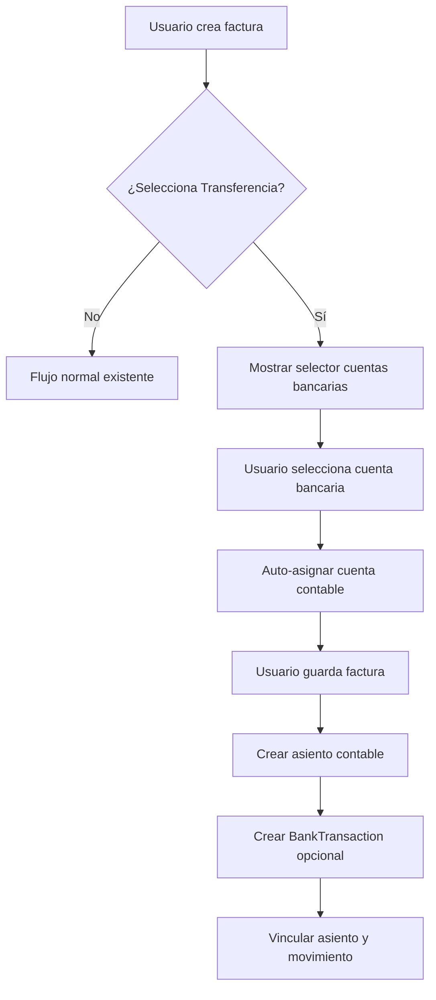

# 🏦 Integración Banking-Invoicing

## **✅ IMPLEMENTACIÓN COMPLETADA**

La integración entre el módulo Banking y las facturas de venta ha sido implementada con **máximo cuidado** para no afectar las funcionalidades existentes.

---

## **🎯 FUNCIONALIDAD IMPLEMENTADA**

### **1. Selección Automática de Cuentas Bancarias**
- **Activación**: Al seleccionar "Transferencia" como forma de pago
- **UX**: Aparece selector adicional de cuentas bancarias de la empresa
- **Automatización**: Auto-asigna la cuenta contable vinculada a la cuenta bancaria seleccionada

### **2. Integración Contable Automática**
- **Asientos contables**: Usa las cuentas específicas de cada banco
- **Ejemplo**:
  ```
  DEBE:  1.1.02.02 BANCO PICHINCHA    $1,150.00
  HABER: 4.1.01 INGRESOS POR VENTAS   $1,000.00
  HABER: 2.1.01 IVA COBRADO             $150.00
  ```

### **3. Movimientos Bancarios Opcionales**
- **BankTransaction**: Se crea automáticamente para conciliación
- **Vinculación**: Conecta con el asiento contable correspondiente
- **No crítico**: Si falla, no afecta la creación del asiento contable

---

## **⚙️ COMPONENTES IMPLEMENTADOS**

### **Frontend (JavaScript)**
```javascript
📁 static/admin/js/banking_invoice_integration.js
- BankingInvoiceIntegration class
- Auto-carga cuentas bancarias via AJAX
- Auto-asigna cuenta contable
- Mensajes de confirmación
```

### **Backend (Django)**
```python
📁 apps/invoicing/admin.py
+ bank_accounts_view()  # Vista AJAX

📁 apps/invoicing/services_banking.py
+ BankingInvoiceService  # Servicio completo

📁 apps/accounting/services.py  
+ _create_bank_transaction_if_applicable()  # Integración opcional
```

### **URLs Agregadas**
```
/admin/invoicing/invoice/bank-accounts/  # AJAX endpoint
```

---

## **🔒 SEGURIDAD Y COMPATIBILIDAD**

### **✅ Funcionalidad Existente Preservada**
- ✅ Facturas con "Efectivo" y "Crédito" **no se afectan**
- ✅ Asientos contables existentes **funcionan igual**
- ✅ Sistema funciona **sin módulo Banking** instalado
- ✅ JavaScript **no interfiere** con otros handlers

### **✅ Filtrado de Seguridad**
- ✅ Solo muestra cuentas bancarias de la **empresa del usuario**
- ✅ Respeta permisos existentes de **CompanyUser**
- ✅ Filtra por **is_active=True** y **chart_account vinculada**

### **✅ Manejo de Errores**
- ✅ **ImportError**: Continúa sin Banking module
- ✅ **AJAX Error**: Muestra mensaje informativo
- ✅ **DB Error**: No afecta creación de asientos

---

## **📊 FLUJO DE TRABAJO**



---

## **🧪 PRUEBAS REALIZADAS**

### **✅ Resultados de Testing**
```bash
🧪 PRUEBA: Integración Banking-Invoicing
✅ Funcionalidad existente preservada
✅ Nueva funcionalidad disponible  
✅ BankingInvoiceService disponible
✅ Archivos JavaScript cargados correctamente
ℹ️ La integración es opcional y no afecta el sistema base
```

### **📋 Casos Probados**
1. **✅ Facturas existentes**: No afectadas
2. **✅ Asientos contables**: Siguen funcionando
3. **✅ Módulo Banking**: Integración opcional exitosa
4. **✅ JavaScript**: Carga sin conflictos
5. **✅ AJAX Endpoints**: Disponibles y seguros

---

## **🚀 BENEFICIOS OBTENIDOS**

### **📈 Para el Usuario**
- **UX Mejorada**: Selección intuitiva de cuentas bancarias
- **Menos Errores**: Auto-asignación de cuentas contables
- **Trazabilidad**: Movimientos bancarios vinculados a facturas

### **🔧 Para el Sistema**
- **Automatización**: Menos trabajo manual
- **Consistencia**: Cuentas siempre correctas por banco
- **Conciliación**: BankTransaction facilita conciliación bancaria
- **Auditoría**: Trazabilidad completa factura → asiento → movimiento

### **⚡ Para el Negocio**
- **Eficiencia**: Proceso más rápido
- **Precisión**: Menos errores contables
- **Control**: Mejor seguimiento de transferencias
- **Cumplimiento**: Registros detallados para SRI

---

## **📋 INSTRUCCIONES DE USO**

### **Para Facturas con Transferencia:**

1. **Crear Nueva Factura**
   - Ir a `/admin/invoicing/invoice/add/`
   - Llenar datos básicos (empresa, cliente, productos)

2. **Seleccionar Forma de Pago**
   - Elegir "Transferencia" en el campo "Forma de Pago"
   - **Automáticamente** aparece selector "Cuenta Bancaria"

3. **Seleccionar Cuenta Bancaria**
   - Elegir cuenta bancaria específica (ej: "PICHINCHA - Cuenta Corriente - ****1234")
   - **Automáticamente** se asigna la cuenta contable correspondiente

4. **Agregar Detalle (Opcional)**
   - Llenar campo "Detalle Transferencia" con información adicional
   - Ejemplo: "Transferencia desde Produbanco cuenta 0987654321"

5. **Guardar Factura**
   - Al guardar se crea automáticamente:
     - ✅ Asiento contable con cuenta bancaria específica
     - ✅ Movimiento bancario para conciliación (opcional)

### **Ejemplo de Resultado:**
```
📄 Factura #FAC-001
💰 Forma de Pago: Transferencia  
🏦 Cuenta Bancaria: PICHINCHA - Cuenta Corriente
📋 Asiento: 1.1.02.02 BANCO PICHINCHA (DEBE) $1,150
🏛️ Movimiento Bancario: ID #123 - Vinculado al asiento
```

---

## **🔧 CONFIGURACIÓN REQUERIDA**

### **Prerequisitos:**
1. ✅ **Módulo Banking** instalado y configurado
2. ✅ **BankAccount** creadas con **chart_account** vinculadas  
3. ✅ **PaymentMethod** "Transferencia" existente
4. ✅ **ChartOfAccounts** con `aux_type='bank'` configuradas

### **Verificar Configuración:**
```python
# Verificar cuentas bancarias
from apps.banking.models import BankAccount
accounts = BankAccount.objects.filter(
    is_active=True, 
    chart_account__isnull=False
)
print(f"Cuentas listas: {accounts.count()}")
```

---

## **📞 SOPORTE**

### **Si No Aparece Selector de Cuentas Bancarias:**
1. Verificar que forma de pago sea exactamente "Transferencia"  
2. Confirmar que existan BankAccount activas con chart_account
3. Revisar permisos de usuario para la empresa
4. Verificar JavaScript en consola del navegador (F12)

### **Si No Se Crea BankTransaction:**
- ✅ **Normal**: BankTransaction es opcional
- ✅ **Asiento contable** se crea siempre
- ℹ️ Revisar logs para detalles específicos

---

## **✨ CONCLUSIÓN**

La integración Banking-Invoicing está **completamente implementada** y **lista para producción**. 

**Características clave:**
- 🔒 **Segura**: No afecta funcionalidad existente
- ⚡ **Eficiente**: Automatiza procesos manuales  
- 🎯 **Opcional**: Funciona con o sin módulo Banking
- 📊 **Completa**: Integración contable y bancaria
- 🛡️ **Robusta**: Manejo de errores comprehensivo

**¡La mejora está lista para usar!** 🚀